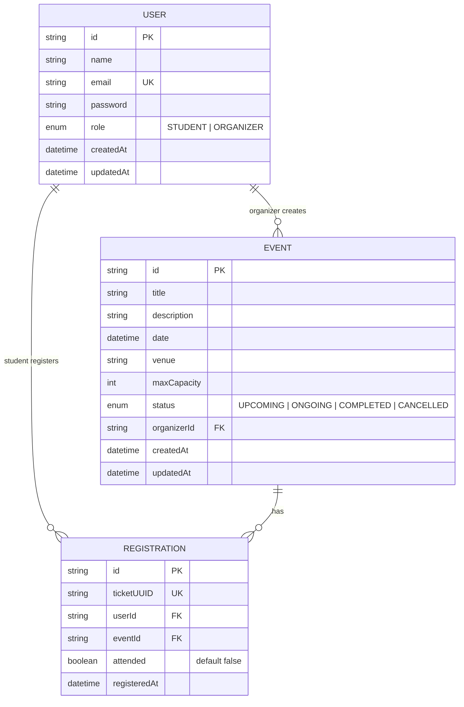

# ER Diagram

```mermaid
erDiagram
    USER {
        string id PK
        string name
        string email UK
        string password
        enum role "STUDENT | ORGANIZER"
        datetime createdAt
        datetime updatedAt
    }

    EVENT {
        string id PK
        string title
        string description
        datetime date
        string venue
        int maxCapacity
        enum status "UPCOMING | ONGOING | COMPLETED | CANCELLED"
        string organizerId FK
        datetime createdAt
        datetime updatedAt
    }

    REGISTRATION {
        string id PK
        string ticketUUID UK
        string userId FK
        string eventId FK
        boolean attended "default false"
        datetime registeredAt
    }

    USER ||--o{ EVENT : "organizer creates"
    USER ||--o{ REGISTRATION : "student registers"
    EVENT ||--o{ REGISTRATION : "has"
```
