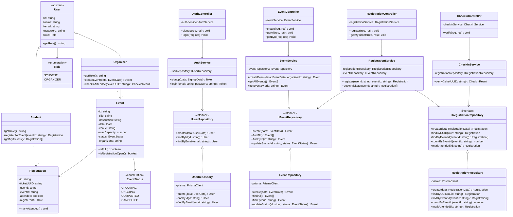

# Class Diagram

```mermaid
classDiagram
    class User {
        <<abstract>>
        #id: string
        #name: string
        #email: string
        #password: string
        #role: Role
        +getRole() string
    }

    class Student {
        +getRole() string
        +registerForEvent(eventId: string) Registration
        +getMyTickets() Registration[]
    }

    class Organizer {
        +getRole() string
        +createEvent(data: EventData) Event
        +checkinAttendee(ticketUUID: string) CheckinResult
    }

    class Event {
        -id: string
        -title: string
        -description: string
        -date: Date
        -venue: string
        -maxCapacity: number
        -status: EventStatus
        -organizerId: string
        +isFull() boolean
        +isRegistrationOpen() boolean
    }

    class Registration {
        -id: string
        -ticketUUID: string
        -userId: string
        -eventId: string
        -attended: boolean
        -registeredAt: Date
        +markAttended() void
    }

    class Role {
        <<enumeration>>
        STUDENT
        ORGANIZER
    }

    class EventStatus {
        <<enumeration>>
        UPCOMING
        ONGOING
        COMPLETED
        CANCELLED
    }

    class IUserRepository {
        <<interface>>
        +create(data: UserData) User
        +findById(id: string) User
        +findByEmail(email: string) User
    }

    class IEventRepository {
        <<interface>>
        +create(data: EventData) Event
        +findAll() Event[]
        +findById(id: string) Event
        +updateStatus(id: string, status: EventStatus) Event
    }

    class IRegistrationRepository {
        <<interface>>
        +create(data: RegistrationData) Registration
        +findByUUID(uuid: string) Registration
        +findByEventId(eventId: string) Registration[]
        +countByEventId(eventId: string) number
        +markAttended(id: string) Registration
    }

    class UserRepository {
        -prisma: PrismaClient
        +create(data: UserData) User
        +findById(id: string) User
        +findByEmail(email: string) User
    }

    class EventRepository {
        -prisma: PrismaClient
        +create(data: EventData) Event
        +findAll() Event[]
        +findById(id: string) Event
        +updateStatus(id: string, status: EventStatus) Event
    }

    class RegistrationRepository {
        -prisma: PrismaClient
        +create(data: RegistrationData) Registration
        +findByUUID(uuid: string) Registration
        +findByEventId(eventId: string) Registration[]
        +countByEventId(eventId: string) number
        +markAttended(id: string) Registration
    }

    class AuthService {
        -userRepository: IUserRepository
        +signup(data: SignupData) Token
        +login(email: string, password: string) Token
    }

    class EventService {
        -eventRepository: IEventRepository
        +createEvent(data: EventData, organizerId: string) Event
        +getAllEvents() Event[]
        +getEventById(id: string) Event
    }

    class RegistrationService {
        -registrationRepository: IRegistrationRepository
        -eventRepository: IEventRepository
        +register(userId: string, eventId: string) Registration
        +getMyTickets(userId: string) Registration[]
    }

    class CheckinService {
        -registrationRepository: IRegistrationRepository
        +verify(ticketUUID: string) CheckinResult
    }

    class AuthController {
        -authService: AuthService
        +signup(req, res) void
        +login(req, res) void
    }

    class EventController {
        -eventService: EventService
        +create(req, res) void
        +getAll(req, res) void
        +getById(req, res) void
    }

    class RegistrationController {
        -registrationService: RegistrationService
        +register(req, res) void
        +getMyTickets(req, res) void
    }

    class CheckinController {
        -checkinService: CheckinService
        +verify(req, res) void
    }

    User <|-- Student
    User <|-- Organizer
    User --> Role
    Event --> EventStatus

    IUserRepository <|.. UserRepository
    IEventRepository <|.. EventRepository
    IRegistrationRepository <|.. RegistrationRepository

    AuthService --> IUserRepository
    EventService --> IEventRepository
    RegistrationService --> IRegistrationRepository
    RegistrationService --> IEventRepository
    CheckinService --> IRegistrationRepository

    AuthController --> AuthService
    EventController --> EventService
    RegistrationController --> RegistrationService
    CheckinController --> CheckinService

    Student "1" --> "*" Registration
    Event "1" --> "*" Registration
    Organizer "1" --> "*" Event
```
