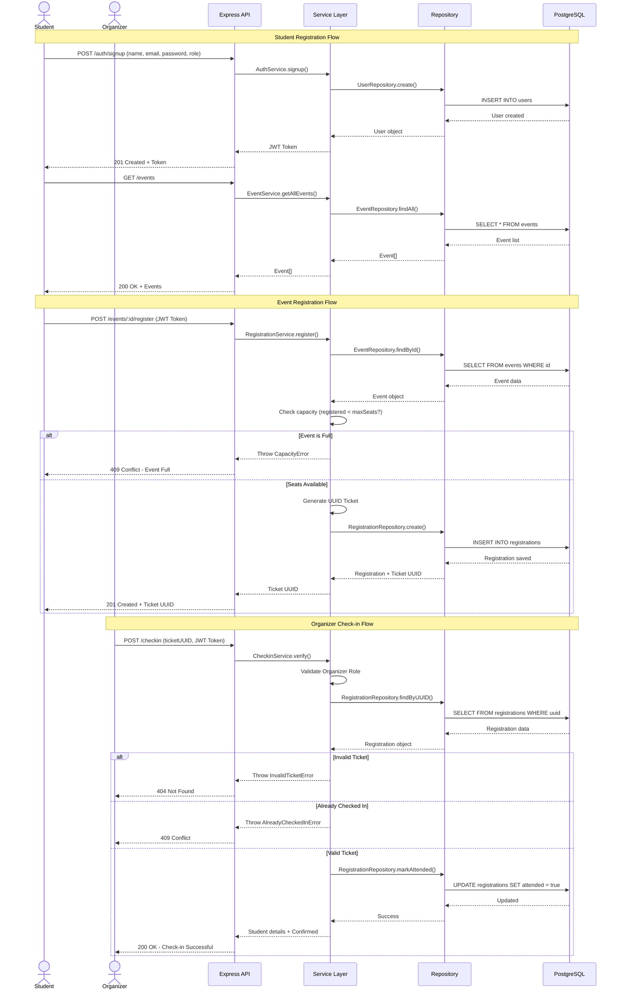

# Sequence Diagram

```mermaid
sequenceDiagram
    actor S as Student
    actor O as Organizer
    participant API as Express API
    participant Svc as Service Layer
    participant Repo as Repository
    participant DB as PostgreSQL

    Note over S, DB: Student Registration Flow

    S->>API: POST /auth/signup (name, email, password, role)
    API->>Svc: AuthService.signup()
    Svc->>Repo: UserRepository.create()
    Repo->>DB: INSERT INTO users
    DB-->>Repo: User created
    Repo-->>Svc: User object
    Svc-->>API: JWT Token
    API-->>S: 201 Created + Token

    S->>API: GET /events
    API->>Svc: EventService.getAllEvents()
    Svc->>Repo: EventRepository.findAll()
    Repo->>DB: SELECT * FROM events
    DB-->>Repo: Event list
    Repo-->>Svc: Event[]
    Svc-->>API: Event[]
    API-->>S: 200 OK + Events

    Note over S, DB: Event Registration Flow

    S->>API: POST /events/:id/register (JWT Token)
    API->>Svc: RegistrationService.register()
    Svc->>Repo: EventRepository.findById()
    Repo->>DB: SELECT FROM events WHERE id
    DB-->>Repo: Event data
    Repo-->>Svc: Event object
    Svc->>Svc: Check capacity (registered < maxSeats?)
    alt Event is Full
        Svc-->>API: Throw CapacityError
        API-->>S: 409 Conflict - Event Full
    else Seats Available
        Svc->>Svc: Generate UUID Ticket
        Svc->>Repo: RegistrationRepository.create()
        Repo->>DB: INSERT INTO registrations
        DB-->>Repo: Registration saved
        Repo-->>Svc: Registration + Ticket UUID
        Svc-->>API: Ticket UUID
        API-->>S: 201 Created + Ticket UUID
    end

    Note over O, DB: Organizer Check-in Flow

    O->>API: POST /checkin (ticketUUID, JWT Token)
    API->>Svc: CheckinService.verify()
    Svc->>Svc: Validate Organizer Role
    Svc->>Repo: RegistrationRepository.findByUUID()
    Repo->>DB: SELECT FROM registrations WHERE uuid
    DB-->>Repo: Registration data
    Repo-->>Svc: Registration object
    alt Invalid Ticket
        Svc-->>API: Throw InvalidTicketError
        API-->>O: 404 Not Found
    else Already Checked In
        Svc-->>API: Throw AlreadyCheckedInError
        API-->>O: 409 Conflict
    else Valid Ticket
        Svc->>Repo: RegistrationRepository.markAttended()
        Repo->>DB: UPDATE registrations SET attended = true
        DB-->>Repo: Updated
        Repo-->>Svc: Success
        Svc-->>API: Student details + Confirmed
        API-->>O: 200 OK - Check-in Successful
    end
```
