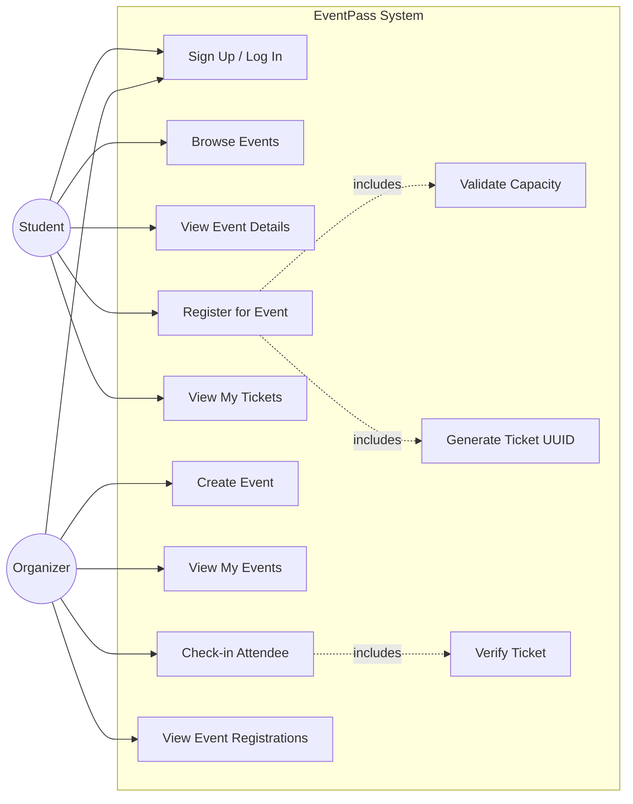

# Use Case Diagram

```mermaid
flowchart LR
    Student(("Student"))
    Organizer(("Organizer"))

    subgraph EventPass System
        UC1["Sign Up / Log In"]
        UC2["Browse Events"]
        UC3["View Event Details"]
        UC4["Register for Event"]
        UC5["View My Tickets"]
        UC6["Create Event"]
        UC7["View My Events"]
        UC8["Check-in Attendee"]
        UC9["View Event Registrations"]
        UC10["Validate Capacity"]
        UC11["Generate Ticket UUID"]
        UC12["Verify Ticket"]
    end

    Student --> UC1
    Student --> UC2
    Student --> UC3
    Student --> UC4
    Student --> UC5

    Organizer --> UC1
    Organizer --> UC6
    Organizer --> UC7
    Organizer --> UC8
    Organizer --> UC9

    UC4 -.->|"includes"| UC10
    UC4 -.->|"includes"| UC11
    UC8 -.->|"includes"| UC12
```
